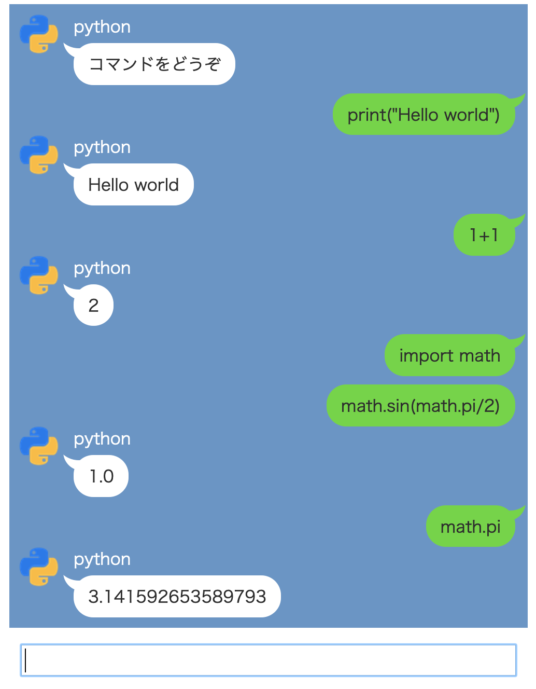

# fukidashi

## 概要
LINE のような見た目で Python, bash などが使えるプログラムです。

## 使い方
server の中にあるスクリプト(websockets-echo.py はオウム返しするだけのスクリプト、websockets-python.py は Python を実行するスクリプト) を実行し、client にある html ファイルを開いて下さい。サーバとクライアントは同じマシンでないと動作しません。

## 動作環境
macOS Mojave でテストしています。Linux でも動くと思います。

## LICENSE
BSD 2-Clause "Simplified" License です。fukidashi.css については https://jisuijisan.com/speech-bubble/ で公開されているものを使っています。
